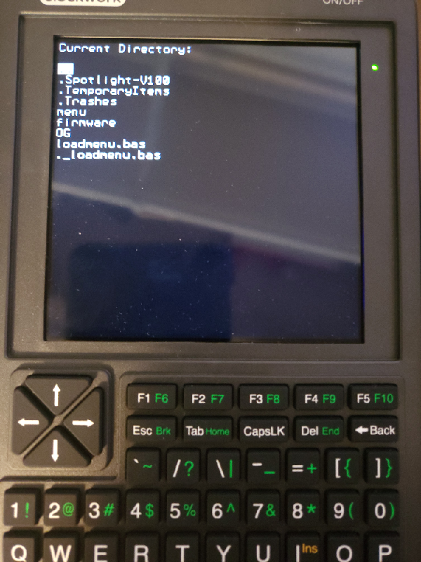

picocalc MMBasic utilities and shell

1. Menu.bas - supports directory and file browsing and launching
   -- Upgraded version based on sample from https://github.com/rlauzon54/PicoCalcBasic 

2. keycodes.bas - print out keycode for whatever key is pressed

